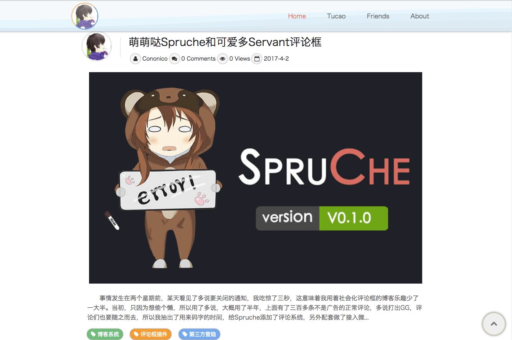
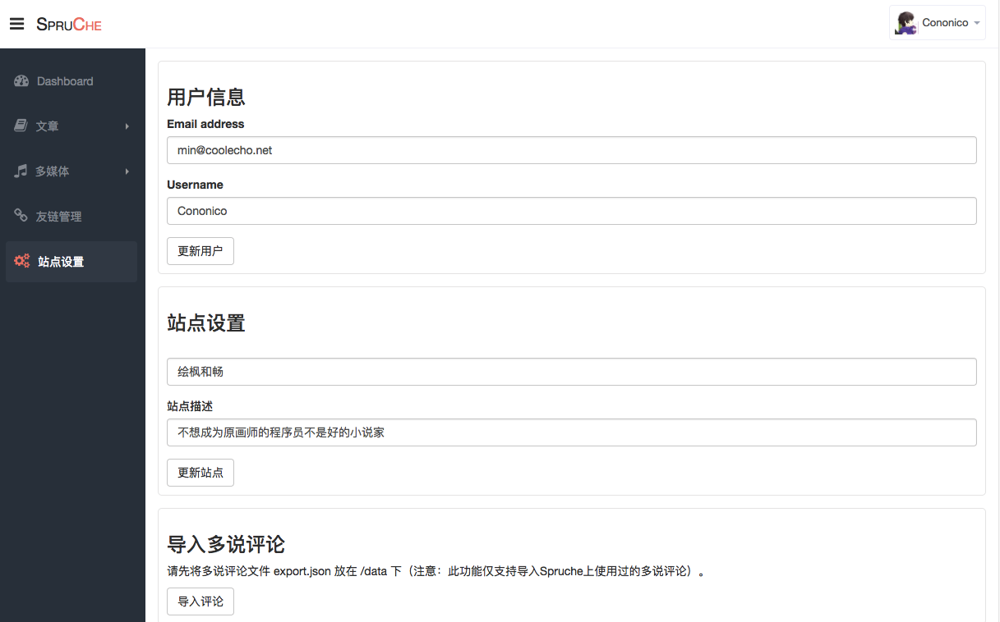

# Spruche

[](https://github.com/IceEnd/Spruche)
[](https://github.com/IceEnd/Spruche/blob/master/LICENSE)

[中文教程](https://www.coolecho.net/article/av17)
[自定义主题](https://www.coolecho.net/article/av37)

## Get Started
Spruche is a beautiful blog system,which is based on Node.js.Here you can go to check the system function--[https://www.coolecho.net](https://www.coolecho.net "绘枫和畅").

### Demo

Default Theme:



Mobile:


WebSite Config:



### Feature
- Article edit, delete, sticky, draft, characteristic pictures, syntax highlighting, use `ueditor` editor.
- Theme DIY.
- Link management.
- Duoshuo comment on import.
- Support for weibo login, reply, praise, trample, reporting, and other functions of high level Servant comment box plug-in in appearance.
- System upgrade to remind.

### Environmental
- Node.js >= 7.0
- mysql >= 5.5.3

## Install
### step 1. Create database
You need to execute SQL script,Create the database scripts are in database.sql.You can be in the mysql command line or execute a statement in the visualization tools, of course you can also define your own database name.for example:<br>
```
create database xxxx;
```

### step 2. System config
Edit `./config.js`:

```js
module.exports = {
  mysql: {
    host: '127.0.0.1',
    user: '***',
    password: '***',
    database:'***',
    port: 3306,
    charset: 'utf8mb4'
  },
  wbApp: {                  // sina developer
    appKey: '***',
    appSecret: '****'
  },
  theme: 'default'         // theme name
};
```

### step 3. Install packages
Open system terminal
```
npm install
```
or
```
yarn
```

### step 4. Start

If you want to start a system, executing the following command.

```
npm start
```
If you want to make the system aways as service, you need install `forever` or `pm2`.
```
npm install -g pm2
```
And then:
```
pm2 start ./bin/www
```

### step 5. System config

You need to access you website:`http://hostname/start` or `https://hostname/start`.Add the corresponding information.

Ok, finished. Now, you can access you website.

### Admin

Access `https://hostname/admin` or `http://hostname/admin`,you can manage system.

## Servant Comment Box

### How to use

import plugin in <head>
```html
<link rel='stylesheet' href='/dist/comments.min.css' />
<script src="/dist/comments.min.js"></script>
```
In the location of the need to comment box embedded script:

```html
<div id="comments">
  <script>
    var options = {
        wbAppKey: '2325634760',
        title: '友情连接',
        threadKey: '/friendslink',
        commentAble: true,
        announcement: '英灵【多说】已经殉职，master正在努力制造新英灵...',
    }
    var servant = new Servant('#comments', options);
    servant.init();
    </script>
</div>
```

Then You should add a connect page like :

```html
<!DOCTYPE html>
<html lang="en">
<head>
    <link rel='stylesheet' href='/stylesheets/style.css' />
    <link rel="shortcut icon" type="image/x-icon" href="/images/icon/favicon.ico" />
</head>
<body>
<div>
    <h3>
        Spruche 正在连接微博...
    </h3>
</div>
<script src="/javascripts/libs/jquery-2.1.4.min.js"></script>
<script src="/javascripts/libs/jquery.cookie.js"></script>
<script src="/dist/comments.min.js"></script>
<script>
    var servant = new Servant();
    servant.getThridToken();
</script>
</body>
</html>
```

### Options

|field|type|default|note|
|-----|-----|------|-----|
|placeholder|string|请自觉遵守互联网相关的政策法规，严禁发布色情、暴力、反动的言论。|textarea placeholder|
|wbAppKey|string|''|sina developer appkey|
|commentAble|bool|true|allow comments|
|announccement|string|''|textarea announccement|
|pageNumber|number|10|comment number each page|
|childrenNumber|number|10|children review each page number|
|threadKey|string|''|page's unique key|
|title|string|''|page's title|

### LICENSE

[MIT](https://github.com/pantsPoi/Spruche/blob/master/LICENSE)
